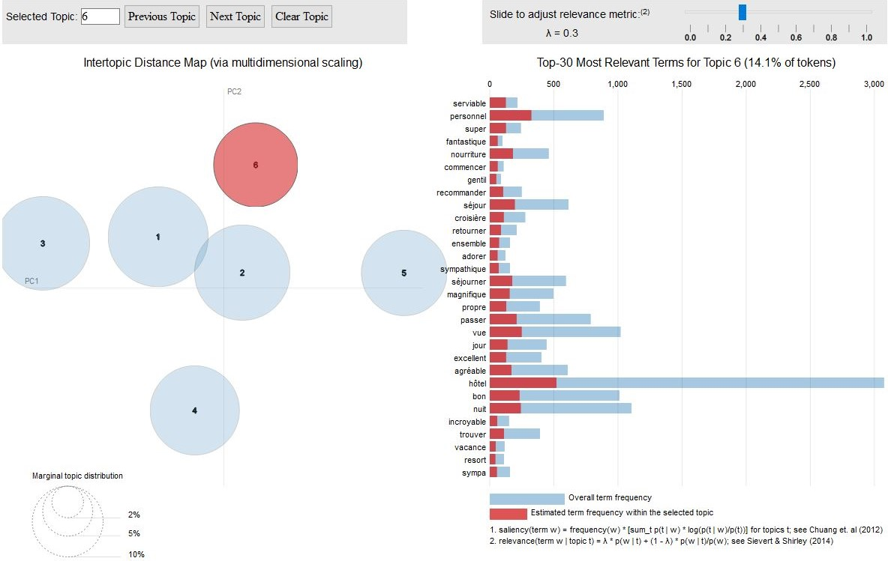

<style type="text/css">
body, td {
   font-size: 14px;
}
code.r{
  font-size: 10px;
}
h1{
  font-size: 24px;
}
h2{
  font-size: 18px;
}
pre {
  font-size: 11px
}
</style>


# 1. Introduction

Dans cette note de recherche nous analysons les commentaires déposés sur Tripadvisor et relatifs à un hôtel en particulier, c'est un corpus de petite taille (1737 commentaire) qui set de corpus test. On aura pu lors d'une visite, réaliser de manière plus concrête, la clarté de certains éléments de résultats, l'observation directe confirme la description indirecte donnée par le texte. On fera tourner plus tard la procédure sur l'intégralité des commentaires. 

L'objectif est d'abord de décrire le contenu de ces textes, puis d'en analyser la tonalité avec plusieurs outils pour en évaluer la consistance. On s'intéressera enfin à la relation entre les indicateurs de sentiments et la note donnée par les évaluateurs. Le texte est-il en accord avec le jugement numérique? 

Cette question est d'autant plus importante que les notes sont l'objet de différents processus qui affectent leur distribution pour leur donner une forme caractéristiques fortement biaisée à droite en faveur des 4 et 5 étoiles. Ce sont des processus psycho-sociaux (biais d'approbation), des processus d'apprentissage, l'effet des dispositifs et algorithmes de moderation (voir la detection de la toxicité cf @)  


Le "pipe" de traitement consiste à

 * 1) annoter les tokens (les termes) par une analyse des éléments du discours (POS) de manière à identifier les lemmes.
 * 2) Réduire le corpus aux : noms communs, adjectifs et adverbes, ainsi qu'aux verbes. On élimine ainsi noms de lieu, ponctuations etc. Avec la lemmatisation cette opération permet de passer outre aux opérations de  a) correction d'orthographe b) harmonisation de la casse, de suppression des stopwords habituels.
 * 3) Construire le modèle de topics (sujets) par une méthode LDA
 * 4) Le visualiser avec LDAvis
 * 5) Annoter le corpus avec les dépendances syntaxiques  et examiner la relation des noms communs à de leurs adjectifs pour mieux apprécier certain aspect s des topics
 * 6) Analyse du sentiment selon la méthode FEEL (nrc) et frLSD. (lexicoder)
 * 7) Analyse des émotions
 * 8) Examiner l'évolution des indicateurs obtenus
 * 9) Comparer les scores de sentiments avec les notes données par les consommateurs
 * 10) Tenter d'expliquer des notes par le textes au travers d'une approche machine-learning avec un modèles naive bayes et des modèles types SVM et random forest.
 * 11) Analyser et évaluer les modèles par des critère AUC et autres.

# 2. Initialisation

L'annotation est réalisée avec `cleanNLP`, on emploie `text2vec` pour le LDA, pour la représentation des dépendances `packcircles` sera utile. Pour le détail du code on consultera le [repo](https://github.com/BenaventC/polynesie).

```{r setup, include=FALSE}
knitr::opts_chunk$set(echo = FALSE, include=TRUE,message=FALSE,warning=FALSE,cache=TRUE)
library(readr)
library(tidyverse) #package a tout faire y compris plot
library(lubridate) #gestion des dates
library(textcat) #reconnaissance de langue
library(cleanNLP) #annotation et sentiment
library(packcircles) # graphiques
library(knitr)
library(kableExtra)
library(gridExtra) #graphiques
library(text2vec)
library(reshape2)
library(ldatuning)
library(quanteda)
library(wesanderson)
```

la lecture du fichier ne pose aucune difficulté, en voici les trois premiers éléments pour avoir une idée de sa structure.

```{r data01, include=TRUE, message=TRUE}
#reviews <- read_csv("resultatb.csv", col_names = FALSE)
reviews <- read_delim("resultatb.csv", 
    ";", escape_double = FALSE, col_names = FALSE, 
    trim_ws = TRUE)

head(reviews,3)
```

# 3. La lemmatisation

Avant d'explorer plus avant le contenu des tweets, on va d'abord annoter le corpus en utilisant les ressources de `cleanNLP` de @arnold_tidy_2017 et en particulier son outil d'annotation des parties du discours (POS) et de lemmatisation qui permettra à la fois d'obtenir les lemmes correspondants à chaque des termes mais aussi leur catégorie morphosyntaxique. Nous nous inspirons largement de leur [étude de cas](https://cran.r-project.org/web/packages/cleanNLP/vignettes/case_study.html)

```{r lemme00, echo = TRUE}
#library(cleanNLP) annotation morpho, lemmes.
text<-reviews$X2
cnlp_init_udpipe(model_name = "french")
obj <- cnlp_annotate(text, as_strings = TRUE)
head(cnlp_get_token(obj))
```

## 3.1 Des éléments du discours (POS)

La composition en catégories  morphosyntaxiques n'est pas forcément évidente à interprêter, il faudrait connaitre leurs distribution dans des corpus de référence (langue standard, ou base d'avis de consommateurs). 

On examine les différentes catégories de termes. Les plus fréquents sont des noms communs, accompagnés des déterminants. Les commentaires seraient-il descriptifs. La ponctuation est fréquente, les adverbes et adjectifs viennent ensuite : signe d'un caractère peu évaluatif et très descriptif ?


```{r lemme01, echo = FALSE}
Vocab<-cnlp_get_token(obj)
Table <- with(Vocab, table(upos))
ling<-as.data.frame(Table)
g1<-ggplot(ling,aes(x=reorder(upos,Freq),y=Freq))+geom_bar(stat="identity",fill="darkgreen")+coord_flip()+theme_minimal()+theme(text = element_text(size=9))
g1+labs(title = "Fréquence des catégories morpho-syntaxiques",caption = "TripAdvisor - un grand hotel",x="catégorie",y="nombre d'avis")
```

Nous pouvons désormais travailler sur un corpus linguistiquement plus homogène. On doit remarquer que le caractère cardinal du découpage est aussi fonction de convention. On pourrait imaginer une détection des langues plus fine qui prendrait en compte les dialectes. C'est le travail des linguistes que de produire des catégories pertinentes et nous nous fierons à leurs avancées. 


## 3.2 verbes, noms communs et adjectif et adverbes

Le texte à l'état brut comporte de nombreux signes qui amènent peu de sens lexical : des points , des noms de lieux, des déterminants. La stratégie que nous engageons est différentes de cette de tm qui juxtapose : mise en minuscule, suppression des ponctuactions, des mentions et des ref html, notre stratégie n'élimine pas mais se concentre sur les éléments lexicaux les plus signifiants. Au moins de manière première, les autres éléments, secondaires, peuvent révéler des flexions plus fines, comme l'usage de la ponctuation le permet - Proust l'aura démontré (@isabelle_serca_les_2010)

Il s'agira ici simplement des verbes, des noms propres, des adjectifs et des adverbes. On en présente les trois distributions.

 * Les noms communs mettent en tête des éléments liés aux logement, à sa localisation et son voisinage, ainsi qu'au séjour et à l'accueil.
 * Les qualificatifs sont très positifs et principalement expressifs, proche, propre et confortable en sont les attributs les plus fréquents
 * Les verbes traduisent une intention : recommendation, des mouvements : stay, walk go et des transaction : get, need...

On filtre les lemmes dont la fréquence est supérieure à 300. 

```{r pos01, fig.width=8, fig.height=4.5, caption ="fréquence des termes par POS : Noms communs, adjectifs et adverbes,verbes"}
Vocab1<-subset(Vocab, upos=="NOUN")
Table <- with(Vocab1, table(lemma))
ling<-as.data.frame(Table) %>% filter(Freq>200)
g2<-ggplot(ling,aes(x=reorder(lemma,Freq),y=Freq))+geom_bar(stat="identity",fill="brown1")+coord_flip()+theme_minimal()+theme_minimal()+ theme(axis.title.x=element_blank())+ theme(axis.title.y=element_blank(),axis.text=element_text(size=9))+labs(title = "Noms communs",x="Noms commun",y="nombre d'avis")

Vocab2<-subset(Vocab, upos=="ADJ" | upos=="ADV")
Table <- with(Vocab2, table(lemma))
ling<-as.data.frame(Table) %>% filter(Freq>200)
g3<-ggplot(ling,aes(x=reorder(lemma,Freq),y=Freq))+geom_bar(stat="identity",fill="brown2")+coord_flip()+theme_minimal()+theme(text = element_text(size=3))+theme_minimal()+ theme(axis.title.y=element_blank(),axis.text=element_text(size=9))+labs(title = "Adjectif ",x="Adverbe et adjectifs",y="nombre d'avis")

Vocab3<-subset(Vocab, upos=="VERB")
Table <- with(Vocab3, table(lemma))
ling<-as.data.frame(Table) %>% filter(Freq>150)
g4<-ggplot(ling,aes(x=reorder(lemma,Freq),y=Freq))+geom_bar(stat="identity",fill="brown4")+coord_flip()+theme_minimal()+theme(text = element_text(size=9), label = NULL)+theme_minimal()+ theme(axis.title.y=element_blank(),axis.text=element_text(size=9))+labs(title = " Verbes",x="verbes",y="nombre d'avis")
grid.arrange(g2,g3,g4,ncol=3)
```

L'expérience reste largement inexprimée si ce n'est pas un jugement très positif (bien, bon, beau) qui nous incite à explorer dans une prochaine section les sentiments et émotions associées. Mais auparavant, tentons d'isoler dans ces ensembles de termes des sujets et thème d'évaluation.De quoi parlent les commentateurs ?

# 4. Un modèle LDA de topics

Pour mieux cerner les sujets on utilise le désormais bien connu modèle LDA avec la solution proposée par [`text2vec`](http://text2vec.org/) et la solution de visualisation interactive `LDAvis`.

On ne retient qu'une partie du corpus : les adjectifs, les noms communs et les verbes. La méthode nous permet d'ôter nombres et signes de ponctuations comme on le fait avec tm et les autres packages, mais aussi les noms de lieux (noms communs) qui peuvent "fragmenter" les topics en leur donnant une spécificité géographique. On travaille sur les lemmes ce qui permet de réduire le bruit généré par les fautes d'orthographes inévitables dans un corpus dont la langue est largement vernaculaire.


```{r lda, fig.height=8,fig.width=9}
tf <- cnlp_get_token(obj) %>%
  filter(upos %in% c("ADJ", "NOUN","VERB")) %>%
  cnlp_utils_tfidf(min_df = 0.05, max_df = 0.95, type = "tf", tf_weight = "raw")
```


Le choix du nombre de solutions peut se faire sur la base de plusieurs critères avec procédure `[ldatuning](https://cran.r-project.org/web/packages/ldatuning/vignettes/topics.html)`. On opte pour un modèle à 6 thèmes. On gagnerait en finesse à choisir une catégorie en 15 thèmes (ou en 10), mais une solution plus simple à 6 semble maximiser le coefficient de @deveaud_accurate_2014. Pour chacun de ces modèles,  la somme des divergences D(ki||kj) entre tous les paires de concepts(ki,kj) est calculée afin de déterminer à quel point les concepts sont correctement délimités. Finalement, le modèle pour lequel la divergence globale est la plus forte est choisit, car c’est celui qui propose la meilleure démarcation entre les concepts. 

```{r lda0}
#with library("ldatuning")

result <- FindTopicsNumber(tf,topics = seq(from = 4, to = 50, by = 1), metrics =c("Deveaud2014"),  method = "Gibbs", control =list(seed = 77),  mc.cores = 4L,  verbose = TRUE )
#FindTopicsNumber_plot(result)
result$topics<-as.factor(result$topics)
test<-melt(result, by=topics)
g_tun<-ggplot(test,aes(x=topics,y=value, group=variable))+geom_line(size=2,color="orange")+facet_grid(variable~.,scales = "free")+theme_minimal()

```

Les résultats se présentent sous la forme d'une liste des termes les plus pertinents selon le critère proposé par @sievert_ldavis_2014 pour chacun des sujets identifiés. 

 * le lieu : beau, superbe, magnifique. il est constitué par le lagon et la piscine et le lagonarium qui est l'originalité de cet hôtel proche de l'aéroport et qui est aussi un hotel de transit.
 * la situation, et les commodités. L'aéroport, la douche.
 * Le spectacle et le buffet forme un troisième point d'intérêt. 
 * La mer, nager un quatrième topic est relatif à l'environnement proche et aux activités
 * le personnel et sa serviabilité marque le 5ème sujet
 * c'est l'accueil qui est désigné dans le dernier sujet.

```{r lda2, fig.width=8, fig.height=4.5, caption ="Topic LDA"}
set.seed(67)
lda_model = LDA$new(n_topics = 6, doc_topic_prior = 0.1, topic_word_prior = 0.01)
doc_topic_distr = 
  lda_model$fit_transform(x = tf, n_iter = 1000, 
                          convergence_tol = 0.001, n_check_convergence = 25, 
                          progressbar = FALSE)
#description des topic en fonction d'un degré de pertinence de lamba ( lambda =1 probabilités)
lda_res<-as.data.frame(lda_model$get_top_words(n = 20, lambda = 0.30))
lda_res$rank<-as.numeric(row.names(lda_res))
lda_res<-melt(lda_res,id.vars = c("rank"))
ggplot(lda_res, aes(x=variable, y= rank, group =  value , label = value)) + scale_y_reverse() + geom_text(aes(color=variable,size=sqrt(26-rank)))+theme_minimal()+scale_color_hue()+guides(color=FALSE,size=FALSE)+labs(x="topics", y="par ordre de pertinence")
```


on pourra générer une visualisation dynamique qui facilite l'interprétation avec le package [`LDAvis`](https://ldavis.cpsievert.me/reviews/reviews.html), en activant le code suivant. (on peut voir ici une [démonstration](http://www.kennyshirley.com/LDAvis/) )


```{r lda03, echo=TRUE}
# la visualisation interactive
library(LDAvis)
lda_model$plot()
```

L'intégration dans le htlm n'étant pas facile on n'en représente qu'une illustration. Le résultat est une visualisation interactive qui pour chacun des topics et des mots indique :

 *  Sa proximité avec les autres topics via une analyse des similarités, ce qui est représenté sur le panneau de gauche. La surface des cercles est proportionnelle à la frequence des tokens. 
 *  Pour un topic donné, le profil est indiqué à droite : les trente principaux termes sont classés par ordre de pertinence (modulée par le paramètre lambda) de haut en bas, leurs fréquences sont indiquées sur les barres horizontales et comparées à la fréquence du mot dans l'ensemble du corpus.

{ width=80% }


 * En cliquant sur les mots on peut aussi observer leur distribution dans les différents groupes et peut en apprécier la spécificité. Dans le cas suivant (serviable) seul quatres thèmes y sont relatifs, plus de la moitié appartiennent au topis "Qualité du personnel"
 
{ width=80% }


# 5. Analyse des dépendances

Certains annotateurs peuvent repérer les règles grammaticales et trouver pour un mot cible ses corrélats.  Un nom commun peut être ainsi associé à des adjectifs qui le qualifient et le nuancent. C'est ainsi que le stanford NLP distingue 55 types de dépendances syntaxiques. Cette annotation peut être produite avec cleannlp. 

On s'intéressera à des dépendences de qualification en optant pour les dépendences 

 * "amod" :  adjectival modifier - An adjectival modifier of an NP is any adjectival phrase that serves to modify the meaning of the NP.“Sam eats red meat”amod(meat, red) 
 * "admod" : adverbial modifier. “Sam eats a lot of meat”amod(meat, a lot of) 

Pour plus de détail il faut consulter le "Stanford typed dependencies manual" @de_marneffe_stanford_2008).  on en trouvera un exposé ici [universal dependencies](http://universaldependencies.org/u/dep/).

Pour mieux comprendre le modèle LDA on peut ainsi être inciter à étudier certains des lemmes contributifs (on ne travaille plus sur le texte brut mais sur un texte filtré). Dans l'exemple suivant, on s'inspire [du code suivant](https://github.com/yanhann10/opendata_viz/tree/master/refugee). Il est [commenté ici ](https://towardsdatascience.com/analyse-public-discourse-on-refugees-with-cleannlp-9719a29ed898).

On représente les qualificatifs de 4 notions qui apparaissent comme étant les plus fréquentes au travers de leur manifestation par l'usage de noms communs : par exemple le  restaurant, la chambre, le lagonarium (qui est l'attraction spectaculaire de cet hotel) et la piscine.


```{r dep01}
dep<-cnlp_get_dependency(obj, get_token = TRUE)
res <- dep %>%filter(relation == "amod" | relation=='advmod')%>%filter(lemma == "restaurant")

bub<-res$lemma_target %>%table() %>%sort(decreasing = TRUE) %>%head(n = 30)%>% as.data.frame()
# libraries library(packcircles)
# Generate the layout
packing <- circleProgressiveLayout(bub$Freq, sizetype='area')
packing$radius=0.95*(packing$radius)
data = cbind(bub, packing)
dat.gg <- circleLayoutVertices(packing, npoints=30)
gd1<- ggplot() + 
  geom_polygon(data = dat.gg, aes(x, y, group = id, fill=id), colour = "black", alpha = 0.6) +
  geom_text(data = data, aes(x, y, size=log(Freq), label = .), color="black") +
  theme_void() +   scale_fill_distiller(palette = "BuPu", direction = -1 ) +
  theme(legend.position="none")+ labs(title="Qualificatifs du lemme 'restaurant'")+
  coord_equal()

#place
dep<-cnlp_get_dependency(obj, get_token = TRUE)
res <- dep %>%filter(relation == "amod")%>%filter(lemma == "hotel"|lemma == "chambre")
bub<-res$lemma_target %>%table() %>%sort(decreasing = TRUE) %>%head(n = 30)%>% as.data.frame()
# libraries library(packcircles)
# Generate the layout
packing <- circleProgressiveLayout(bub$Freq, sizetype='area')
packing$radius=0.95*packing$radius
data = cbind(bub, packing)
dat.gg <- circleLayoutVertices(packing, npoints=30)
gd2<- ggplot() + 
  geom_polygon(data = dat.gg, aes(x, y, group = id, fill=id), colour = "black", alpha = 0.6) +
  geom_text(data = data, aes(x, y, size=log(Freq), label = .), color="black") +
  theme_void() +   scale_fill_distiller(palette = "PuRd", direction = 1 ) +
  theme(legend.position="none")+ labs(title="Qualificatifs du lemmes 'chambre'")+coord_equal()

dep<-cnlp_get_dependency(obj, get_token = TRUE)
res <- dep %>%filter(relation == "amod")%>%filter(lemma == "lagon")
bub<-res$lemma_target %>%table() %>%sort(decreasing = TRUE) %>%head(n = 30)%>% as.data.frame()

# libraries library(packcircles)
# Generate the layout
packing <- circleProgressiveLayout(bub$Freq, sizetype='area')
packing$radius=0.95*packing$radius
data = cbind(bub, packing)
dat.gg <- circleLayoutVertices(packing, npoints=30)
gd3<- ggplot() + 
  geom_polygon(data = dat.gg, aes(x, y, group = id, fill=id), colour = "black", alpha = 0.6) +
  geom_text(data = data, aes(x, y, size=log(Freq), label = .), color="black") +
  theme_void() +   scale_fill_distiller(palette = "YlGn", direction = -1 ) +
  theme(legend.position="none")+ labs(title="Qualificatifs du lemme 'lagon'")+
  coord_equal()

#place
dep<-cnlp_get_dependency(obj, get_token = TRUE)
res <- dep %>%filter(relation == "amod")%>%filter(lemma == "piscine")
bub<-res$lemma_target %>%table() %>%sort(decreasing = TRUE) %>%head(n = 30)%>% as.data.frame()
# libraries library(packcircles)
# Generate the layout
packing <- circleProgressiveLayout(bub$Freq, sizetype='area')
packing$radius=0.95*packing$radius
data = cbind(bub, packing)
dat.gg <- circleLayoutVertices(packing, npoints=30)
gd4<- ggplot() + 
  geom_polygon(data = dat.gg, aes(x, y, group = id, fill=id), colour = "black", alpha = 0.6) +
  geom_text(data = data, aes(x, y, size=log(Freq), label = .), color="black") +
  theme_void() +   scale_fill_distiller(palette = "Blues", direction = 1 ) +
  theme(legend.position="none")+ labs(title="Qualificatifs du lemme 'piscine' ")+coord_equal()

gd1
gd2
gd3
gd4
```


# 6. Analyse du sentiment 

Dans les sections précédentes on a caractérisé les contenus, dérivant des polarités positives et négatives dans les contenus. C'est cette polarité qui va être l'objet de l'analyse du sentiment qui est mené dans cette 6ème section.

On filtre le corpus sur un critère de 10 caractères minimum, au moins trois mots, et on élimine les textes très longs, de plus de 5000 caractères,  qui contribuent plus que proportionnellement au corpus. 

```{r sent02, echo=TRUE}
library(syuzhet)             #analyse du sentimeent
reviews$nbcar<-as.numeric(nchar(reviews$X2))
df_en<-reviews %>% filter(nbcar>10 & nbcar<5000)
```

## 6.1 La distribution du sentiment

On utilise le package [syuzhet](https://www.rdocumentation.org/packages/syuzhet/versions/1.0.4) et en particulier le dictionnaire  "nrc" developpé et traduit par @mohammad_crowdsourcing_2013 ( Index Feel)

```{r sent02b, echo=TRUE}

#paramètres
method <- "nrc"
lang <- "french"
phrase<-as.character(df_en$X2)
#extraction
my_text_values_french<- get_sentiment(phrase, method=method, language=lang)
```

Le sentiment est globalement plutôt positif, même si une fraction  des contributions présentent des valeurs négatives. La variance est relativement élevée, ce qui est le signe d'une certaine sensibilité. Il se distribue plutôt normalement au moins de manière symétrique.

```{r sent03}
Zissou <- wes_palette(4, name = "Zissou1", type = "continuous")   #pour l'intensite
#ajout de la colonne sentiment au tableau de données des contributions:
sent<-as.data.frame(my_text_values_french)
sent$sentiment<-as.numeric(sent$my_text_values_french)
df_en<-cbind(df_en,sent)
#statistiques 
mean<-round(mean(df_en$sentiment),2)
std<-round(sd(df_en$sentiment),2)
#histogram
df_en$quintile<-cut(df_en$sentiment, quantile(df_en$sentiment))
ggplot(df_en, aes(x=sentiment))+geom_histogram(binwidth=1,aes(fill=quintile))+theme_minimal()+xlim(-15,+30) +scale_fill_manual(values=Zissou)+ ggplot2::annotate("text", x=150, y=4.5, label= paste0("moyenne=",mean,"ecart type",std))
```


## 6.2 Un indicateur dépendant de la longueur du texte

En corrélant le nombre de caractères et le score primaire de sentiment une corrélation nette apparait, elle est de l'ordre de 0.56, elle s'atténue quand la taille du texte déapsse les 700 caractères. Quand on corrèle au score de sentiment standardisé, c'est une relation inverse qui apparait, même si elle est moins forte  ( r= 0.26) , plus le texte est long est plus il est neutre, mais prudence, neutre en moyenne, pas forcément en qualité d'expression. 
astuce des quintile

```{r score01 , echo = FALSE}
r_n_s<-round(cor(df_en$nbcar, df_en$sentiment),3)

g24<-ggplot(df_en,aes(x=nbcar, y=sentiment))+geom_point(color="grey")+geom_smooth(method="auto")+geom_smooth(method="lm",color="darkorange")+theme_minimal() + ggplot2::annotate("text", x=800, y=30, label= paste0("r=",r_n_s))
#score de sentiment
df_en$sent_score<-df_en$sentiment*100/df_en$nbcar
r_n_s<-round(cor(df_en$nbcar, df_en$sent_score),3)

g25<-ggplot(df_en,aes(x=nbcar, y=sent_score))+geom_point(color="grey")+geom_smooth(method="auto")+geom_smooth(method="lm",color="darkorange")+theme_minimal()+ ggplot2::annotate("text", x=800, y=4.5, label= paste0("r=",r_n_s))
grid.arrange(g24,g25, ncol=2)
```

La transformation opérée montre une relation linéaire claire dans le segment [-10,10], audelà le score de sentiment devient invariant avec le grand nombre de mention positive qui résulte d'un commentaire long.

```{r score02 , echo = FALSE}
#statistiques 
mean<-round(mean(df_en$sent_score),2)
std<-round(sd(df_en$sent_score),2)

#histogram
df_en$quintil2<-cut(df_en$sent_score, quantile(df_en$sent_score))
g26<-ggplot(df_en, aes(x=sent_score))+geom_histogram(aes(fill=quintil2))+theme_minimal()+ ggplot2::annotate("text", x=0, y=250, size=2.5,label= paste0("Moyenne=",mean," Sd=",std ))+scale_fill_manual(values=Zissou)

#statistiques 

g27<-ggplot(df_en, aes(x=sentiment ,y=sent_score))+geom_point(color="grey")+theme_minimal()+geom_smooth(method="loess")
grid.arrange(g26,g27, ncol=2)

```


# 7. Analyse des émotions - nrc

Le même outil fournit un autre système d'annotation qui compte les mentions d'éléments positifs ou négatifs, ainsi que d'émotions définies sur la base de l'inventaire de @plutchik_psychoevolutionary_1982 on utilise simplement la fonction `get_nrc_sentiment`, en précisant le dictionnaire adéquat. L'échelle comprend en fait deux éléments : les 8 émotion de base *au sens de pluchik, et deux indicateurs de polarité.
L'opérationnalisation réalisée par @mohammad_crowdsourcing_2013 s'inscrit dans une tradition de la recherche en marketing, se souvenir de @havlena_varieties_1986 et de @westbrook_dimensionality_1991.

```{r sent07}
emotions <- get_nrc_sentiment(phrase,language = "french")
```

## 7.1 Les polarités
On s'intéresse d'abord aux mentions positives et négatives. (la mesure permet ainsi une dyssémétrie des deux polarités, il y a le bien, le mal, le mal et le bien, mais aussi si qui n'est ni mal ni bien). 
Les textes étant inégaux en taille on va ramener l'indicateur de polarité au nombre de caractères (sur une base de 100 c) de chaque contribution. En effet l'algo compte les valence et leur intensité est proportionnel à la longueur du texte. Ce qui est clairement démontré par la seconde figue. 
A partir de ces deux mesures,  4 indicateurs peuvent être construits
 *  Positivité : nombre de termes positifs pour 100 signes.
 *  Négativitivé : nombre de termes négatifs pour 100 signes.
 *  Valence : rapport du nombre de termes positifs sur les négatifs.
 *  Expressivité : nombre de termes positifs et négatifs.
le dernier graphe nous apprend que les jugements plutôt positifs sont aussi les plus expressifs. La "froideur" des commentaires les plus négatifs reflète-t-elle une crainte de la désaprobation sociale? C'est une piste de recherche à poursuivre, on pourrait s'attendre à ce que les commentaires les plus négatifs surgissent plus facilement si la densité des négatives est plus importante et observer une sorte d'autocorrélation.

```{r sent08}
polarity<-subset(emotions,select=c(positive, negative))
df_en1<-cbind(df_en,polarity)
sum(df_en1$positive)
sum(df_en1$negative)

G1<-ggplot(df_en1, aes(x=positive))+geom_histogram(binwidth = 1, fill="darkred")+xlim(-1,40)+ylim(0,400)+theme_minimal()+ ggplot2::annotate("text", x=0, y=350, size=2.5,label= paste0("n=",sum(df_en1$positive)))
G2<-ggplot(df_en1, aes(x=negative))+geom_histogram(binwidth = 1,fill="blue4")+xlim(-1,40)+ylim(0,400)+theme_minimal()+ ggplot2::annotate("text", x=0, y=350, size=2.5,label= paste0("n=",sum(df_en1$negative)))
grid.arrange(G1,G2,ncol=2)
```

La relation entre le nombre de mention et la taille du texte est évidente et de l'ordre de 0.75.

```{r sent08a}
rp<-round(cor(df_en1$nbcar, df_en1$positive),2)
rn<-round(cor(df_en1$nbcar, df_en1$negative),2)


G01<-ggplot(df_en1, aes(x=nbcar,y=positive ))+geom_point(color="grey")+geom_smooth(method = "gam", formula = y ~ s(x, bs = "cs"))+xlim(0,5000)+theme_minimal()+ylim(0,30)+ ggplot2::annotate("text", x=0, y=30, size=2.5,label= paste0("n=",rp))
G02<-ggplot(df_en1, aes(x=nbcar,y=negative ))+geom_point(color="grey")+geom_smooth(method = "gam", formula = y ~ s(x, bs = "cs"))+xlim(0,5000)+theme_minimal() +ylim(0,30)+ ggplot2::annotate("text", x=0, y=30, size=2.5,label= paste0("n=",rn))
grid.arrange(G01,G02,ncol=2)

```

L'idée de transformer cet indicateur brut en le rapportant à un même nombre de caractères (10 ou environ un token) est donc justifiée. On observe une symétrie l'effet de la valence sur l'expressivité, même si une contribution plus forte de la négativité. Négativité et positivité ne sont pas corrélés. 

```{r sent08b}

df_en1$positivity<-(df_en1$positive*10)/(df_en1$nbcar)
df_en1$negativity<-(df_en1$negative*10)/(df_en1$nbcar)
df_en1$valence<-df_en1$positivity-df_en1$negativity
df_en1$expressivity<-df_en1$positivity+df_en1$negativity

G11<-ggplot(df_en1, aes(x=valence,y=expressivity ))+geom_point(color="grey")+geom_smooth(method = "gam", formula = y ~ s(x, bs = "cs"))+theme_minimal()
G12<-ggplot(df_en1, aes(x=negativity,y=positivity ))+geom_point(color="grey")+geom_smooth(method = "gam", formula = y ~ s(x, bs = "cs"))+theme_minimal()

rbind
G13<-ggplot(df_en1, aes(x=negativity,y= expressivity))+geom_point(color="grey")+geom_smooth(method = "gam", formula = y ~ s(x, bs = "cs"))+theme_minimal()+ylim(0,.75)+xlim(0,.6)
G14<-ggplot(df_en1, aes(x=positivity,y= expressivity))+geom_point(color="grey")+geom_smooth(method = "gam", formula = y ~ s(x, bs = "cs"))+theme_minimal()+ylim(0,.75)+xlim(0,.6)
grid.arrange(G11,G12,G13,G14,ncol=2)

```

## 7.2 La palette des émotions

On se concentre sur les 8 facettes de l'émotion telle que conceptualisée par [Plutchik](https://positivepsychologyprogram.com/emotion-wheel/) (@plutchik_psychoevolutionary_1982)

dont on reprend les définitions en anglais :
"
 * trust goes from acceptance to admiration
 * fear goes from timidity to terror
 * surprise goes from uncertainty to amazement
 * sadness goes from gloominess to grief
 * disgust goes from dislike to loathing
 * anger goes from annoyance to fury
 * anticipation goes from interest to vigilance
 * joy goes from serenity to ecstasy"
 
et mesurée sur la base des textes par l'outil NCR élaborée par [Mohammad Saif](http://saifmohammad.com/WebPages/lexicons.html) et pour le français [voir](http://sentiment.nrc.ca/lexicons-for-research/).
On peut raisonner en part relative des émotions dans le mesure où l'outil NCR compte les éléments probables de chacune des émotions. C'est pourquoi on recode les variables, encore une fois les textes long risquent de peser plus que les textes courts, la normalisation est nécessaire.


```{r sent10}
#recodage relatif
emocol<-c("yellow","chartreuse","olivedrab3","green4","royalblue3","purple3","red3","orangered1") #en respectant des codes mais il faudra adoucir.
emo<-subset(emotions,select=-c(positive, negative))
emo$tot<-rowSums (emo, na.rm = FALSE, dims = 1)
emo$tot[is.na(emo$tot)]<-0.000001
emo$anger<-emo$anger/emo$tot
emo$anticipation<-emo$anticipation/emo$tot
emo$disgust<-emo$disgust/emo$tot
emo$fear<-emo$fear/emo$tot
emo$joy<-emo$joy/emo$tot
emo$sadness<-emo$sadness/emo$tot
emo$surprise<-emo$surprise/emo$tot
emo$trust<-emo$trust/emo$tot
#emo<-subset(emo,select=-c(tot))
df_en2<-cbind(df_en1,emo)
#la distribution des émotions
  
emo2<-melt(emo)
emo2$variable<-factor(emo2$variable, ordered = TRUE,levels = c("joy","trust","fear","surprise","sadness","disgust","anger","anticipation"))
emo3<-aggregate(value~variable,data=emo2, FUN="mean")
g101<-ggplot(data=emo3,  aes(x=variable, y=value, colour=variable)) + 
  geom_bar(stat="identity", aes(fill=variable)) +
  xlab("Emotions") + 
  ylab("%") + 
  ylim(-0.05,.35) + ggtitle("Distribution des émotions")  + 
  geom_hline(aes(yintercept=0), lwd=0.3, lty=1) + 
  coord_polar()+ scale_color_manual(values=emocol)+ scale_fill_manual(values=emocol)+theme_minimal()

g102<-ggplot(emo2, aes(x=variable, y=value))+geom_violin(aes(fill=variable), alpha=0.7,adjust = 2)+theme_minimal()+ylim(0,1)+ scale_fill_manual(values=emocol)+ylim(0,0.5)+ coord_flip()
grid.arrange(g101,g102,ncol=2)

```

On complète l'analyse par une typologie simple (méthode de ward) qui fait apparaitre 4 grandes répondes émotionnelles. L'une marginale( 4) est clairement négative, une autre représente un  tiers des observations peut être qualifiée de mitigée ( une fréquence élevé de tristesse), les deux autres qui représentent un peu plus de 60% sont franchement positives se distinguant pour l'une par une forte attention et l'autre par un plus grand sentiment de confiance.


```{r sent10b}
# Ward Hierarchical Clustering
#ggplot(emo,aes(x=tot))+geom_histogram()

#typologie des émotions

emo4<-subset(emo, select=-tot) 
emo4<-emo4 %>% drop_na()
d <- dist(emo4, method = "euclidean") # distance matrix
fit <- hclust(d, method="ward") 
plot(fit) # display dendogram
groups <- cutree(fit, k=4) # cut tree into 4 clusters
# draw dendogram with red borders around the 4 clusters
rect.hclust(fit, k=4, border="red") 
emo4<-cbind(emo4,groups)

typo_n<-as.data.frame(prop.table(table(emo4$groups)))
library(ggalt)
ggplot(typo_n) +
  aes(x = reorder(Var1,Freq), y = Freq) +
  geom_lollipop() +
  xlab("Types") +
  ylab("Effectifs") +
  coord_flip()

typo_emo<-aggregate(cbind(joy,trust,fear,surprise,sadness,disgust,anger,anticipation) ~ groups, data = emo4, FUN="mean")
emo5<-melt(typo_emo, id="groups")
emo5$groups<-as.factor(emo5$groups)
ggplot(emo5,aes(x=variable,y=value,colour=variable))+ geom_bar(stat="identity", aes(fill=variable)) +
  xlab("Emotions") + 
  ylab("%") + 
  ylim(-0.05,.35) + ggtitle("Distribution des émotions dans le corpus tripadvisor")  + 
  geom_hline(aes(yintercept=0), lwd=0.3, lty=1) + 
  coord_polar()+ scale_color_manual(values=emocol)+ scale_fill_manual(values=emocol)+theme_minimal()+facet_wrap(~ groups, ncol=2)

```
# 8. Notes et sentiments

Si on examine les corrélations entre les notes délivrées par les commentateurs et le sentiment tel qu'il est mesuré par nos instrutements (basés sur le dictionnaire FEEL) on observe de très faibles corrélations, 0.25 au mieux pour la valence. Celà va dans le bon sens mais exprime ausi un hiatus entre le commentaire et la note. 

On sait que cette dernière répond fortement aux besoins d'approbation sociale (trouver des refs : moscovici déjà) et devient peu discriminante (ex : . On lira par exemple pour un approfondissement sur cette question. On notera que les système de réputation s'y adapte en introduisant des choix de d'indicateurs d'emotions. Facebook a été le premier à répondre à ce sujet @eranti_social_2015, linkedIn vient de s'y mettre.


```{r sent11}
ggplot(df_en2,aes(x=X6))+geom_histogram(fill="salmon3")+theme_minimal()

r_sx<- round(cor(df_en2$X6,df_en2$valence),2)
ggplot(df_en2,aes(x=X6,y=valence))+geom_point(position = "jitter")+geom_smooth(method = "loess")+theme_minimal()+ ggplot2::annotate("text", x=1, y=0.5, size=2.5,label= paste0("r=",r_sx))+ylim(0,0.5)

M<-subset(df_en2, select=c(sentiment, sent_score,valence,positivity,negativity, expressivity,X6))
M <- cor(M)
library(corrplot)
corrplot.mixed(M)
```

Il peut être intéressant de tester l'hypothèse avec un autre score de sentiment. La faible corrélation est peut être le fruit de notre instrument de mesure. On utilise le lexicoder (@duval_analyse_2016) avec `quanteda`. D'autres packages (en français) sont possibles comme `pattern.nlp` et un travail de comparaison systématique pourrait être utile et faire l'objet d'un papier de recherche à part entière, nous ne faisons qu'esquisser un tel travail. En anglais beaucoups plus d'indicateurs sont disponibles. On réutilise les transformations en valence et expressivité.

```{r sent12}
#library(pattern.nlp)
#z <- pattern_sentiment("j'ai horreur du mal", language = "french")#pattern_sentiment("j'aime Paris, c'est super", language = "french")
```

On s'aperçoit dans l'analyse des corrélation que les valences obtenue avec les deux outils conergent avec des valences corréles à 0.55 et des expressivity de 0.88. Les notes sont mieux corrélée ( 0.34) mais c'est une valeur encore faible, bien plus faible que la convergence de nos deux indicateurs. On doit constater le divorce entre la tonalité des commentaires et les notes attribuée.

```{r sent13}
dictfile <- tempfile()
download.file("http://dimension.usherbrooke.ca/voute/frlsd.zip", dictfile, mode = "wb")
unzip(dictfile, exdir = (td <- tempdir()))
dic_ton <- dictionary(file = paste(td, "frlsd.cat", sep = "/"))

df_senti<-df_en$X2 %>% tokens(what = "word", remove_numbers = TRUE, 
                              remove_punct=TRUE, remove_symbols = TRUE,
                              remove_separators = TRUE, remove_twitter = TRUE,
                              remove_hyphens = FALSE, remove_url = TRUE, 
                              ngrams = 1L)

senti<-tokens_lookup(df_senti, dictionary = dic_ton, exclusive = FALSE)
#head(senti,2)

#Application du dictionnaire des sentiments: obtient l'occurence des termes positifs et des termes négatifs par commentaire
analyseSentiments <- dfm(df_senti, dictionary = dic_ton)

#Transformation en un data.frame avec transformation du nom des variables
dfBaseSpecifique=data.frame(analyseSentiments,nb=ntoken(df_senti), id=rownames(df_en2))

df_en3<-cbind(df_en2,dfBaseSpecifique)
df_en3$positivity_lsd<-df_en3$POSITIVE*100/df_en3$nbcar
df_en3$negativity_lsd<-df_en3$NEGATIVE*100/df_en3$nbcar
df_en3$valence_lsd<-df_en3$positivity_lsd-df_en3$negativity_lsd
df_en3$expressivity_lsd<-df_en3$positivity+df_en3$negativity_lsd

ggplot(df_en3,aes(x=positivity_lsd,y=negativity_lsd))+geom_point()+geom_smooth(method="loess")
ggplot(df_en3,aes(x=valence_lsd,y=expressivity_lsd))+geom_point()+geom_smooth(method="loess")

ggplot(df_en3,aes(x=X6,y=valence_lsd))+geom_point()+geom_smooth(method = "lm")+theme_minimal()
M<-subset(df_en3, select=c(sentiment,sent_score,valence,valence_lsd,positivity,positivity_lsd,negativity, negativity_lsd,expressivity, expressivity_lsd, X6))
M <- cor(M)
library(corrplot)
corrplot.mixed(M)
regnote<-lm(X6~valence_lsd+expressivity_lsd, data=df_en3)
summary(regnote)
```


# 8. Analyse chronologique

Il s'agit ici d'examiner l'évolution de nos indicateurs de sentiments. On se limite à la période postérieure à 2009 pour une question de densité de contributions. On en profite pour observer la convergence des indicateurs produits à partir des deux dictionnaires FEEL et FrLSD. Ils évoluent bien ensemble, peut-être moins en terme de négativité où une lègère divergence semble se manifester.

```{r sent14}
#nb avis par an
library(lubridate)
date<-transpose(strsplit(df_en3$X4,split=" "))
year<-date[[2]]
dat <- data.frame(matrix(unlist(year), nrow=1737, byrow=T),stringsAsFactors=FALSE)
dat$year<-as.numeric(dat[,1])
dat<-subset(dat, select=year)
df4<-cbind(df_en3,dat)

long<-df4 %>% filter(year>2009 & year<2019)%>%group_by(year)%>%summarize(n=n(),sentiment=mean(sentiment),sent_score=mean(sent_score),positivity=mean(positivity),negativity=mean(negativity))

ggplot(long,aes(x=year, y =n))+geom_bar(stat="identity")

#p
long1<-df4 %>% filter(year>2009 & year<2019)%>%group_by(year)%>%summarize(positivity=mean(positivity),negativity=mean(negativity),positivity_lsd=mean(positivity_lsd),negativity_lsd=mean(negativity_lsd))
long1<-melt(long1, id.vars="year")

ggplot(long1,aes(x=year,y=value,group=variable))+geom_line(aes(color=variable),size=1.2,stat="identity")+theme_minimal()+  scale_color_manual(values=Zissou)

long2<-df4 %>% filter(year>2009 & year<2019)%>%group_by(year)%>%summarize(expressivity=mean(expressivity),valence=mean(valence),expressivity_lsd=mean(expressivity_lsd),valence_lsd=mean(valence_lsd))

long2<-melt(long2, id.vars="year")

ggplot(long2,aes(x=year,y=value,group=variable))+geom_line(aes(color=variable),size=1.2,stat="identity")+theme_minimal()+  scale_color_manual(values=Zissou)

```

# 9. Un modèle naives bayes pour prédire la note

On utilise un modèle très simple. Le plus basique qui soit. 

#https://fderyckel.github.io/2016-12-07-Texts_Classification_in_R/


## 9.1 Constitution du corpus

```{r cars}
library(tm)
library(e1071)
library(dplyr)
library(caret)
# Library for parallel processing
#library(doMC)

library(readr)
#reviews <- read_csv("resultat.csv", col_names = FALSE)
head(reviews,1)

corpus <- Corpus(VectorSource(df_en$X2))
# Inspect the corpus
corpus
inspect(corpus[2:3])
corpus.clean <- corpus %>%
  tm_map(content_transformer(tolower)) %>% 
  tm_map(removePunctuation) %>%
  tm_map(removeNumbers) %>%
  tm_map(removeWords, stopwords(kind="fr")) %>%
  tm_map(stripWhitespace)

```

## 9.2 fabriquer le DTM

On constitue deux sous corpus 60% et 40% pour l'entrainement et le test et on considère les bigrams.

```{r dtm0}
NgramTokenizer <- function(x) {
      unlist(lapply(ngrams(words(x), 2), paste, collapse = " "), use.names = FALSE)
}

dtm_NLP <- DocumentTermMatrix(corpus.clean, control=list(tokenize = NgramTokenizer))

# Inspect the dtm
inspect(dtm_NLP[40:45, 100:108])

df.train <- df4[1:1000,]
df.test <- df4[1001:1737,]

dtm.train <- dtm_NLP[1:1000,]
dtm.test <- dtm_NLP[1001:1737,]

corpus.clean.train <- corpus.clean[1:1000]
corpus.clean.test <- corpus.clean[1001:1737]

dim(dtm.train)


fivefreq <- findFreqTerms(dtm.train, 20)
length((fivefreq))
```

## 9.3 selectioner les termes les plus fréquents to build the DTM

et recoder les fréquences en variables binaires
Function to convert the word frequencies to yes (presence) and no (absence) labels


```{r dtm2}

dtm.train.nb <- DocumentTermMatrix(corpus.clean.train, control=list(dictionary = fivefreq))
dim(dtm.train.nb)

dtm.test.nb <- DocumentTermMatrix(corpus.clean.test, control=list(dictionary = fivefreq))
dim(dtm.test.nb)


convert_count <- function(x) {
  y <- ifelse(x > 0, 1,0)
  y <- factor(y, levels=c(0,1), labels=c("No", "Yes"))
  y
}

# Apply the convert_count function to get final training and testing DTMs

trainNB <- apply(dtm.train.nb, 2, convert_count)
testNB <- apply(dtm.test.nb, 2, convert_count)
```

## 9.4 Le modèle

On utilise ici la fonction naiveBayes du package e7000 mais d'autres solutions sont possibles. Un paramètre doit cependant être fixé, la valeur de la constante de lissage de Laplace. On trouvera ici et là les explications nécessaires sur son rôle et son choix.

https://en.wikipedia.org/wiki/Additive_smoothing

http://rocr.bioinf.mpi-sb.mpg.de/


```{r bayes}
df.train$class<-0
df.train$class[df.train$X6>3]<-1
df.train$class<-as.factor(df.train$class)

df.test$class<-0
df.test$class[df.test$X6>3]<-1
df.test$class<-as.factor(df.test$class)


classifier <- naiveBayes(trainNB,df.train$class , positive="1",laplace = 1)
pred <- predict(classifier,testNB,type = "raw")
predC <- predict(classifier,testNB,type = "class")
```


## 9.5 Evaluation du modèle

Pour évaluer le modèle on emploie la fonction confusion matrix mais aussi le package ROCR qui fournit tous les indicateurs habituels du machine learning. On évalue d'abord le modèle. La précision est de 0,782 ( et de 0.68 quand elle est équilibrée), elle doit être comparé à la prévalence qui est de 84% (). La précision (sensitivity) est de  .90  et le recall de 0,83 (specificity) le F est donc de 0.86 et l'auc de 0.78. le taux de detection est de 0,69. le coefficient kappa peut être qualifié de correct (fair) ce qui indique que la prediction tout en étant sensible est peu précise. 

Manifestement le contenu des avis et les notes sont assez peu lié. La corrélation du sentiment et des notes nous en donnait déjà l'idée, elle se confirme ici, même si nous n'employons qu'un modèle très simple.(D'autre SVM, RF et autres pourraient être testés à leur tour, on pourrait affiner les choses en utilisant du word embedness).


```{r eval}


predC<-as.data.frame(predC)

pred<-as.data.frame(pred)
pred$Pos<-pred[,2]
pred$Neg<-pred[,1]
df.test<-cbind(df.test,pred,predC)

conf.mat <- confusionMatrix(df.test$predC, df.test$class,positive="1")
print(conf.mat)


ggplot(df.test,aes(x=Pos, fill=class))+geom_histogram(binwidth =0.05, alpha=0.5,position = "dodge")

library(ROCR)

# plot a ROC curve for a single prediction run
# and color the curve according to cutoff.
df <- data.frame(df.test)
predROC <- prediction(df$Pos, df$class)
perf1 <- performance(predROC,"tpr","fpr")
plot(perf1,colorize=TRUE)

perf2<- performance(predROC,"prec","rec")
plot(perf2,colorize=TRUE)
auc<-performance(predROC,"auc")
auc
```

Un résultat accessoire est l'identification des termes qui contribuent à la prédiction. On va extraire du classificateur (qui se présente comme une liste de tableau croisés entre la note (neg/positive) et la présence/absence du terme) donnant les probabilité a postériori (probabilité d'avoir le terme sachant que la classe est negative ou positive). On calcule la différence entre les probabilités d'être positif et négatif, un fort écart indique le pouvoir discriminant du termes).

On y voit clairement les termes discriminants : en positif, la piscine, le personnel, la vue et des adjectifs hyperbolique. En négatif le prix.... Il y a là matière à construire un nouvel index de sentiment.....

```{r eval2, echo=TRUE, result=FALSE}

#extraction des probabilité conditionnelle (p=W/positif)
classifier$tables$ambiance["1","Yes"]         # p(dept.A|admitted)
for(i in classifier$tables){print(i["1","Yes"])}
k=0
output <- matrix(ncol=2, nrow=571)
for(i in classifier$tables){
  k=k+1
  output[k,1]<-i["1","Yes"]
  output[k,2]<-i["0","Yes"]}
output<-as.data.frame(output)
```


```{r eval3}

df <- as.data.frame(rownames((as.data.frame(t(trainNB)))))
postprob<-cbind(df,output)
postprob$delta<-postprob$V1-postprob$V2
postprob$Name<-postprob[,1]
ggplot(postprob, aes(x=V1,y=delta))+geom_point(col="grey")+ geom_text(aes(label=ifelse(abs(delta)>0.05,as.character(Name),'')),size =2.5,hjust=0,vjust=0)+scale_x_log10()+theme_minimal()+labs(x="Probabilité a posteriori que le terme soit associé à une bonne note")

```


# 10. Bibliographie